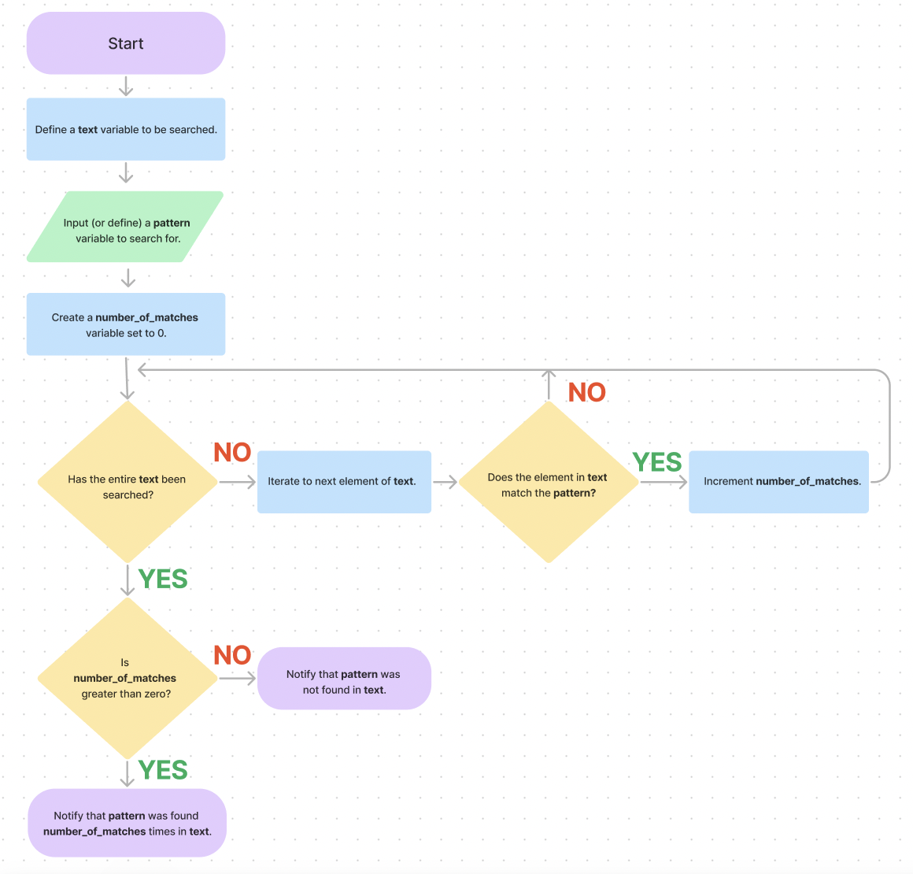

# Pattern-Searching Algorithm Flowchart and Pseudocode

## Description

Student project for the Codecademy course Introduction to IT, under the curriculum's section "Software Development Concepts."

**_Learning objectives_**: First, to design the steps of a hypothetical pattern-searching algorithm that searches for a specific value within a larger set of data; second, to convert the steps into a full flowchart illustrating function with the conventional notation of ANSI shapes (for example, a rectangle represents a process, a diamond represents a conditional operation, a rhombus represents an input/output, an oval represents a start/end terminal, and the flowline arrows represent the order of operations); third, to convert the flowchart to pseudocode.

This project showcases the ability to present and communicate algorithms or technical solutions in a way that is comprehensible to others in a professional setting--regardless of their level of technical expertise or training. In combination with the flowchart, the pseudocode serves as a useful reference for adapting the solution to whatever programming language, while also clarifying procedures so that the developer(s) can write clean, efficient code. Thus, on display is a collaborative skill, valuable for a general audience, that on more specific level is also a productivity tool that facilitates software development.

## Flowchart

To view this flowchart on Figma, follow this link: [https://www.figma.com/file/e73JKnhScvc8MC4aaylfIc/pattern-searching-algorithm-flowchart?node-id=0%3A1&t=p6fj61NU7IFyZy4e-1](https://www.figma.com/file/e73JKnhScvc8MC4aaylfIc/pattern-searching-algorithm-flowchart?node-id=0%3A1&t=p6fj61NU7IFyZy4e-1)



## Pseudocode

Here is a translation of the flowchart's algorithm to pseudocode:

```
define text
define/input pattern
define number_of_matches
if the entire text hasn't been searched:
   iterate to next element of text
   if element in text is equal to pattern:
      increment number_of_matches
if number_of_matches is greater than zero:
   notify that pattern was found number_of_matches times in text
otherwise:
   notify that pattern was not found in text
```
